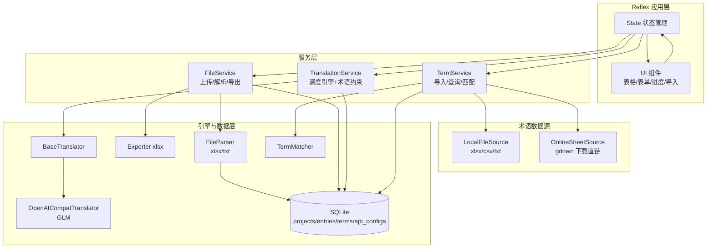

## 产品概述

一个基于 Python + Reflex 的通用本地化可视化翻译平台，实现"上传源文件 → 调用大模型 API 翻译 → 人工可视化校对编辑 → 列表展示 → 导出交付文件"的完整闭环。定位为通用工具而非写死流程的个人工具，首期单用户运行，但架构预留多用户、多翻译引擎、多术语数据源的扩展空间。

## 核心功能

- 文件工程管理：以单个上传文件（xlsx/txt）为一个工程单元，围绕该文件进行解析、翻译、校对与产出
- 文件解析：支持 Excel(xlsx) 表格类与 txt 文档类源文案抽取，还原为条目列表
- 多引擎翻译适配：翻译引擎抽象为适配器架构，首期实现 GLM（走 OpenAI 兼容接口），用户可配置 base_url/api_key/model；预留多平台源码迭代扩展
- 术语库多数据源导入：支持两种导入方式——上传本地文件（xlsx/csv/txt）与读取在线表格直链（如 Google Sheets 分享直链，通过下载解析扒取术语）
- 术语约束：术语库命中时翻译阶段优先采用指定译法，校对阶段高亮提醒命中条目
- 可视化校对编辑：以"源文案 ↔ 译文"对照表格呈现，人工在线编辑、标记状态（待译/已译/已校对/需复核）
- 产出展示：后台列表展示翻译结果与进度统计
- 导出交付：导出为 xlsx 表格文件（含源文案、各语言译文、状态、术语命中标记）
- 进度概览：整体翻译进度、已校对比例、术语命中统计

## 首期范围

跑通核心闭环（上传解析 → GLM 翻译 → 人工编辑校对 → 列表展示 → 导出 xlsx），含术语库本地/在线双源导入，不做登录与多用户隔离（数据模型预留 user_id）。

## 技术栈选型

- 前后端一体化框架：Reflex（纯 Python，自带响应式 Web UI 与状态管理，无需前后端分离，契合单机工具场景）
- 翻译引擎客户端：openai 库（GLM 等大模型均提供 OpenAI 兼容接口，统一走 /chat/completions）
- 文件解析：pandas + openpyxl（xlsx 读写）、内置文本处理（txt）
- 术语在线表格源：gdown 库（解析 Google Drive/Sheets 分享直链并下载为 CSV/TSV），无需 API Key，最轻量
- 数据持久化：SQLite + SQLModel，数据模型预留 user_id 字段
- 导出：openpyxl 生成 xlsx
- 运行环境：Windows / PowerShell，Python 3.10+

## 实现策略

采用"分层 + 适配器"架构，将翻译引擎、文件解析、术语数据源、术语约束解耦为独立模块，Reflex 层只负责状态管理、UI 渲染与流程编排。

1. **翻译引擎适配器**：抽象 `BaseTranslator`，首期实现 `OpenAICompatTranslator`（GLM），通过配置区分；引擎注册表驱动 UI 下拉。
2. **术语数据源适配器**：抽象统一导入入口，将不同来源归一化为术语条目列表——本地文件源复用文件解析能力；在线表格源用 gdown 下载直链导出为表格后解析。
3. **术语约束两阶段分离**：翻译阶段将命中术语注入系统 Prompt；校对阶段在列表中对命中条目高亮，实现"约束 + 提醒"。
4. **数据模型**：以文件工程(Project)为顶层单元，内含 Entry（源文案条目，多语言译文字段、状态、术语命中标记）；统一预留 user_id。
5. **Reflex 状态类**：通过 rx.event 驱动翻译/校对/导出；大数据量列表分页加载避免渲染卡顿。

## 架构设计



## 目录结构

```
LocalizationTool/
├── app.py                       # [NEW] Reflex 应用入口，页面路由与页面组件定义
├── localization/
│   ├── __init__.py              # [NEW] 包初始化
│   ├── state.py                 # [NEW] Reflex 核心状态类：工程列表、条目管理、翻译/校对/导出/术语导入事件
│   ├── config.py                # [NEW] 全局配置（数据库路径、默认模型、上传目录）
│   ├── models.py                # [NEW] SQLModel 数据模型：Project/Entry/TermEntry/ApiConfig
│   ├── db.py                    # [NEW] SQLite 初始化与会话管理
│   ├── services/
│   │   ├── __init__.py          # [NEW] 服务包
│   │   ├── file_service.py      # [NEW] 上传保存、解析调度（按扩展名）、导出 xlsx
│   │   ├── parser.py            # [NEW] 文件解析器：ExcelParser、TxtParser、CsvParser
│   │   ├── exporter.py          # [NEW] openpyxl 导出含源/译/状态/术语命中列
│   │   ├── translation_service.py # [NEW] 批量翻译调度、分批防超时、注入术语约束
│   │   ├── term_service.py      # [NEW] 术语导入调度、查询、匹配（子串命中）
│   │   └── term_sources.py      # [NEW] 术语数据源适配器：LocalFileSource/OnlineSheetSource(gdown)
│   ├── translators/
│   │   ├── __init__.py          # [NEW] 引擎注册表（ENGINE_REGISTRY）
│   │   ├── base.py              # [NEW] BaseTranslator 抽象基类
│   │   └── openai_compat.py     # [NEW] OpenAICompatTranslator（GLM）
│   └── components/
│       └── __init__.py          # [NEW] 可复用 Reflex 组件（对照表格、进度条、术语命中标记）
├── requirements.txt             # [NEW] reflex、openai、pandas、openpyxl、sqlmodel、gdown 等
├── uploads/                     # [NEW] 上传/导出文件存储目录（运行时生成）
└── README.md                    # [NEW] 项目说明、启动方式、架构、扩展新引擎/新数据源指引
```

## 关键接口设计

```python
# translators/base.py — 翻译引擎抽象
class BaseTranslator(abc.ABC):
    name: str
    def __init__(self, config: ApiConfig): ...
    @abc.abstractmethod
    def translate(self, text: str, target_lang: str, term_context: list[str]) -> str: ...

# services/term_sources.py — 术语数据源抽象（多源归一化）
class BaseTermSource(abc.ABC):
    def __init__(self, source: str): ...          # source: 本地路径 或 在线直链
    @abc.abstractmethod
    def fetch_rows(self) -> list[tuple[str, str, str]]: ...  # 归一为 (源术语, 目标术语, 备注)

class LocalFileSource(BaseTermSource): ...         # 复用 parser 解析 xlsx/csv/txt
class OnlineSheetSource(BaseTermSource):           # 用 gdown 下载 Google 直链 → 解析表格

# models.py — 核心数据模型（均预留 user_id）
class Project(SQLModel):   # 一个上传文件 = 一个工程
    id, user_id, filename, file_type, source_lang, target_langs(str)
    upload_time, total_count, translated_count, proofread_count
class Entry(SQLModel):     # 源文案条目
    id, user_id, project_id, source_text, translations(JSON: {lang: text})
    status, term_hits(JSON), sort_index
class TermEntry(SQLModel): # 术语库
    id, user_id, source_term, target_term, note
class ApiConfig(SQLModel): # 用户可配置的多引擎 API
    id, user_id, engine_name, base_url, api_key, model, is_default
```

## 实施注意事项

- 翻译批量调用分批（如每批 20 条）并在 UI 反馈进度，避免超时与卡顿
- 术语匹配用子串检测即可满足首期；翻译时 Prompt 注入"若出现以下术语请优先采用指定译法"
- Google Sheets 直链下载需处理 id 提取与导出参数（如 &export=format=csv），gdown 支持该场景
- API 密钥存本地 SQLite，仅本地单用户可接受；预留脱敏与后续加密空间
- 导出列：序号、源文案、目标语言译文（每语言一列）、状态、命中术语
- 首期不引入认证，但所有模型含 user_id 字段且默认 user_id=0，后期多用户仅需加过滤
- 术语源列约定（源术语/目标术语/备注），不同来源在导入时归一为统一三元组

采用现代化浅色工作台风格，兼顾专业与易用，适合后台数据编辑场景。整体以清晰的信息层级和克制的色彩呈现翻译工作流。

- 布局：顶部导航区分功能模块（我的文件、翻译校对、术语库、引擎配置），主体为对照表格工作区
- 对照编辑：采用"源文案 | 目标语言译文"双列表格，行内可直接编辑译文，状态用彩色徽标区分（待译灰、已译蓝、已校对绿、需复核橙）
- 进度概览：顶部进度条组件实时显示翻译/校对完成率，术语命中条目行内高亮提示
- 术语导入：术语库页提供"本地文件 / 在线链接"两种导入入口，导入结果即时预览并确认入库
- 交互：批量翻译按钮带进度反馈，行内编辑即时保存，hover 行高亮
- 响应式：桌面端为主，表格支持分页与筛选（按状态、按术语命中）

## Agent Extensions

### Skill

- **xlsx**
- 用途：在文件解析与导出环节，读取用户上传的 xlsx 源文件、导出翻译校对结果 xlsx，并校验本地术语文件（xlsx/csv）解析逻辑
- 预期产出：确保源文件/术语库的表格读取与多语言译文、状态、术语命中列的 xlsx 导出正确

### SubAgent

- **code-explorer**
- 用途：实施阶段核查 Reflex 项目脚手架（app 入口、rx.State 事件、组件组织方式）与 SQLModel 集成最佳实践，确认术语数据源 gdown 直链下载的可行写法
- 预期产出：确认新建模块与 Reflex/SQLModel 框架约定一致，避免路径与 API 偏差