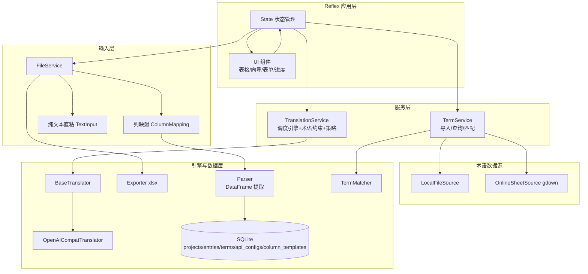

## 产品概述

一个基于 Python + Reflex 的通用本地化可视化翻译平台，实现"输入内容 → 调用大模型 API 翻译 → 人工可视化校对编辑 → 列表展示 → 导出交付文件"的完整闭环。定位为通用工具而非写死流程的个人工具，首期单用户运行，但架构预留多用户、多翻译引擎、多术语数据源、多输入格式的扩展空间。

## 核心功能

- **灵活输入（本次核心）**：支持两种输入方式，均围绕"工程"展开：
- 文件工程：上传 xlsx/txt/csv 文件作为一个工程单元，围绕该文件解析、翻译、校对、产出
- 纯文本直粘：直接粘贴一段文字即可翻译，无需文件，逐行/分段作为条目，也可进入校对表格
- **列映射通用化解析**：不写死列名。导入表格时先预览前几行，自动猜测每列的语义角色，用户可手动下拉修正，并可将常用列映射保存为模板下次套用。解决不同文件列结构不一致的问题
- **多引擎翻译适配**：翻译引擎抽象为适配器架构，首期实现 GLM（走 OpenAI 兼容接口），用户可配置 base_url/api_key/model；预留多平台源码迭代扩展
- **术语库多数据源**：支持两种导入——本地文件（xlsx/csv/txt）与在线表格直链（Google Sheets 分享直链，gdown 下载解析）。术语约束模式：翻译时命中术语优先采用指定译法，校对时高亮提醒
- **可视化校对编辑**："源文案 | 各目标语言译文"对照表格，行内在线编辑，标记状态（待译/已译/已校对/需复核）
- **已有译文策略**：每个目标语言列可配置"跳过已有译文 / 覆盖重译"
- **产出展示**：后台列表展示翻译结果与进度统计
- **导出交付**：导出 xlsx（含源文案、各语言译文、状态、术语命中标记）

## 首期范围

跑通核心闭环（输入解析 → GLM 翻译 → 人工校对 → 列表展示 → 导出 xlsx），含术语库本地/在线双源导入与纯文本直粘，不做登录与多用户隔离（数据模型预留 user_id）。

## 视觉目标

现代化浅色工作台风格，对照表格驱动，状态用彩色徽标区分，进度条实时反馈，导入向导分步引导，术语命中行内高亮。

## 技术栈选型

- 前后端一体化：Reflex（纯 Python，自带响应式 Web UI 与状态管理，无需前后端分离，契合单机工具场景）
- 翻译引擎客户端：openai 库（GLM 等大模型均提供 OpenAI 兼容接口，统一走 /chat/completions）
- 文件解析：pandas + openpyxl（xlsx/csv 读写）、内置文本处理（txt）
- 术语在线表格源：gdown 库（解析 Google Drive/Sheets 分享直链并下载为表格文件），无需 API Key
- 数据持久化：SQLite + SQLModel，数据模型预留 user_id 字段
- 导出：openpyxl 生成 xlsx
- 运行环境：Windows / PowerShell，Python 3.10+

## 实现策略

采用"分层 + 适配器"架构，将翻译引擎、文件解析、术语数据源、列映射解耦为独立模块，Reflex 层只负责状态管理、UI 渲染与流程编排。

1. **列映射驱动解析（核心）**：不写死列名。解析层将表格读为原始 DataFrame，依据 `ColumnMapping`（列→语义角色映射）提取源/目标/键/忽略列，归一化生成条目。语言代码通过正则/词典自动猜测，用户可手动修正。
2. **列映射模板**：映射可序列化为模板持久化存储，下次导入一键套用；模板含 CRUD。
3. **翻译引擎适配器**：抽象 `BaseTranslator`，首期实现 `OpenAICompatTranslator`（GLM）；引擎注册表驱动 UI 下拉。
4. **术语数据源适配器**：抽象统一导入入口，归一化为 (源术语, 目标术语, 备注) 三元组。
5. **术语约束两阶段**：翻译阶段注入系统 Prompt；校对阶段高亮命中条目。
6. **Reflex 状态类**：rx.event 驱动翻译/校对/导出/导入；大数据量列表分页加载。
7. **已有译文策略**：翻译调度时按目标语言列配置判断跳过或覆盖。

## 架构设计



## 核心目录结构

```
LocalizationTool/
├── app.py                       # [NEW] Reflex 应用入口，页面路由与页面组件定义
├── localization/
│   ├── __init__.py              # [NEW] 包初始化
│   ├── state.py                 # [NEW] Reflex 核心状态类：工程/条目/翻译/校对/导出/导入事件
│   ├── config.py                # [NEW] 全局配置（数据库路径、默认模型、上传目录）
│   ├── models.py                # [NEW] SQLModel 模型：Project/Entry/TermEntry/ApiConfig/ColumnTemplate
│   ├── db.py                    # [NEW] SQLite 初始化与会话管理
│   ├── services/
│   │   ├── __init__.py          # [NEW] 服务包
│   │   ├── file_service.py      # [NEW] 上传/纯文本/解析调度/列映射应用/导出
│   │   ├── column_mapping.py    # [NEW] ColumnMapping 数据结构、语言猜测、模板序列化/CRUD
│   │   ├── parser.py            # [NEW] 读原始 DataFrame + 按映射提取条目
│   │   ├── exporter.py          # [NEW] openpyxl 导出
│   │   ├── translation_service.py # [NEW] 批量翻译、分批、注入术语、跳过/覆盖策略
│   │   ├── term_service.py      # [NEW] 术语导入调度、查询、匹配
│   │   └── term_sources.py      # [NEW] 术语数据源适配器 LocalFileSource/OnlineSheetSource
│   ├── translators/
│   │   ├── __init__.py          # [NEW] 引擎注册表 ENGINE_REGISTRY
│   │   ├── base.py              # [NEW] BaseTranslator 抽象基类
│   │   └── openai_compat.py     # [NEW] OpenAICompatTranslator（GLM）
│   └── components/
│       └── __init__.py          # [NEW] 可复用 Reflex 组件
├── requirements.txt             # [NEW] reflex/openai/pandas/openpyxl/sqlmodel/gdown
├── uploads/                     # [NEW] 上传/导出目录（运行时生成）
└── README.md                    # [NEW] 说明、架构、扩展指引
```

## 关键接口设计

```python
# 列语义角色定义
COLUMN_ROLES = ("source", "key", "ignore")  # 目标语言列以 "target_<lang_code>" 标记

class ColumnMapping(BaseModel):
    name: str                       # 模板名
    role_by_column: dict[str, str]  # {列名: 角色}，target 角色含语言代码
    target_strategy: dict[str, str] # {语言: "skip_existing"|"overwrite"}
    auto_detected: bool             # 是否自动猜测

# services/column_mapping.py — 语言自动猜测
def guess_column_roles(headers: list[str]) -> dict[str, str]:
    # 用语言词典/正则（中文/EN/韓/日/泰...）识别 source 与各 target 语言

# translators/base.py
class BaseTranslator(abc.ABC):
    name: str
    def __init__(self, config: ApiConfig): ...
    @abc.abstractmethod
    def translate(self, text: str, target_lang: str, term_context: list[str]) -> str: ...

# services/term_sources.py
class BaseTermSource(abc.ABC):
    def __init__(self, source: str): ...
    @abc.abstractmethod
    def fetch_rows(self) -> list[tuple[str, str, str]]: ...
class LocalFileSource(BaseTermSource): ...
class OnlineSheetSource(BaseTermSource): ...  # gdown 下载直链

# models.py
class Project(SQLModel):    # 含 file_type, source_lang, target_langs(str), column_mapping(JSON)
class Entry(SQLModel):      # translations JSON {lang: text}, status, term_hits(JSON)
class TermEntry(SQLModel):  # source_term, target_term, note
class ApiConfig(SQLModel):  # engine_name, base_url, api_key, model, is_default
class ColumnTemplate(SQLModel):  # 列映射模板持久化
# 所有模型均预留 user_id，默认 0
```

## 实施注意事项

- 翻译批量分批（每批 20 条）并在 UI 反馈进度，避免超时卡顿
- 术语匹配用子串检测；翻译 Prompt 注入"若出现以下术语请优先采用指定译法"
- 语言自动猜测需含语言词典与正则；无法识别时降级为手动指认
- 纯文本按空行分段/整段策略，UI 提供切分方式选择
- Google Sheets 直链下载需处理 id 提取与导出参数（&export=format=csv）
- API 密钥存本地 SQLite，仅本地单用户可接受；预留脱敏空间
- 导出列：序号、源文案、各目标语言译文（每语言一列）、状态、命中术语
- 所有模型含 user_id 默认 0，后期多用户仅需加过滤

采用现代化浅色工作台风格，兼顾专业与易用，适合后台数据编辑场景。以清晰信息层级与克制色彩呈现翻译工作流，全程动态反馈。

- 布局：顶部导航区分功能模块（我的工程、翻译校对、术语库、引擎配置、列模板），主体为对照表格工作区
- 导入向导：上传文件后进入分步向导——步骤1 预览表格前几行 + 自动猜测列角色；步骤2 每列下拉手动指认语义角色与目标语言、选择每个目标语言的"跳过/覆盖"策略；步骤3 保存为模板并确认生成条目。采用步骤指示器与即时预览，指引清晰
- 对照编辑：源文案列 + 各目标语言译文列的多列表格，行内直接编辑，状态用彩色徽标（待译灰/已译蓝/已校对绿/需复核橙），术语命中行高亮
- 进度概览：顶部进度条实时显示翻译/校对完成率与术语命中统计
- 纯文本直粘：首页提供粘贴卡片，选择目标语言与切分方式（逐行/按空行分段/整段），预览分段后一键翻译
- 交互：批量翻译按钮带进度反馈，行内编辑即时保存，hover 行高亮，卡片与向导带平滑过渡动画
- 响应式：桌面端为主，表格分页与按状态/术语命中筛选

## Agent 扩展

### Skill

- **xlsx**
- 用途：在解析与导出环节读取用户上传的 xlsx 源文件、导出翻译校对结果 xlsx，并校验本地术语文件（xlsx/csv）解析逻辑与列映射提取正确性
- 预期产出：确保源文件/术语库的表格读取、列映射归一化提取、多语言译文与状态列的 xlsx 导出均正确

### SubAgent

- **code-explorer**
- 用途：实施阶段核查 Reflex 项目脚手架（app 入口、rx.State 事件、组件组织方式）与 SQLModel 集成最佳实践，确认 gdown 直链下载、pandas 列映射提取的可行写法
- 预期产出：确认新建模块与 Reflex/SQLModel 框架约定一致，避免路径与 API 偏差