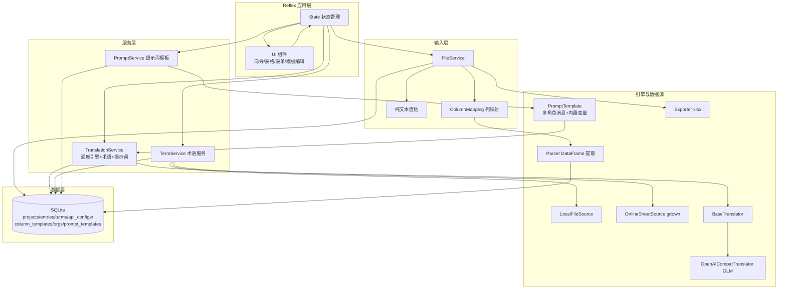

## 产品概述

一个基于 Python + Reflex 的通用本地化可视化翻译平台，实现"多态输入 → AI 翻译 → 人工校对 → 列表展示 → 导出交付"完整闭环。定位为通用工具：用户可自配置翻译 API、术语库、提示词模板，并支持组织内共享。首期单用户运行，但数据层全面预留多用户与组织扩展。

## 核心功能

- 多态输入：文件上传（xlsx/csv/txt）与纯文本直粘两种方式，均围绕"工程"展开
- 通用列映射解析：不写死列名，导入时预览表格、自动猜测列语义角色、用户手动指认，并可保存/套用列模板，适配任意结构文件
- 多引擎翻译适配：引擎抽象为适配器架构，首期实现 GLM（OpenAI 兼容接口），用户可配置 base_url/api_key/model，支持源码迭代扩展新平台
- 提示词模板管理（本次核心）：大模型指令不写死，作为独立实体存储；支持 System/User/Assistant 多角色消息序列；内置变量占位（{source_text}/{target_lang}/{term_context}/{source_lang}/{user_instruction}）；按组织共享，其他用户通过组织 ID/邀请码加入即获得该组织模板；模板与引擎独立可任意组合
- 术语库双源导入：本地文件(xlsx/csv/txt) + 在线表格直链(Google Sheets，gdown 下载)；术语约束模式——翻译时命中注入指定译法，校对时高亮提醒
- 可视化校对编辑：源文案与各目标语言译文的对照表格，行内编辑，状态徽标（待译/已译/已校对/需复核），术语命中高亮
- 已有译文策略：每个目标语言列可选"跳过已有/覆盖重译"
- 产出展示与导出：后台列表展示、进度统计，导出 xlsx（含源文案、各语言译文、状态、命中术语列）

## 视觉目标

现代化浅色工作台风格，表格驱动、状态徽标、进度条实时反馈、导入向导分步引导、术语命中行内高亮、提示词模板多角色可视化编辑。

## 首期范围

跑通核心闭环（输入解析 → GLM 翻译 → 人工校对 → 列表展示 → 导出 xlsx），含提示词模板管理、术语库双源导入、纯文本直粘。不做登录鉴权，数据模型预留 user_id 与 org_id。

## 技术栈

- 前后端一体化：Reflex（纯 Python，自带响应式 UI 与状态管理）
- 翻译引擎客户端：openai 库（GLM 走 OpenAI 兼容接口 /chat/completions，messages 数组天然支持多角色）
- 文件解析：pandas + openpyxl（xlsx/csv）、内置文本处理（txt）
- 在线表格源：gdown（解析 Google Drive/Sheets 分享直链下载）
- 数据持久化：SQLite + SQLModel，所有模型预留 user_id/org_id
- 导出：openpyxl
- Python 版本兼容：环境现有 Python 3.14.6 过新（Reflex/sqlmodel/pydantic 可能不兼容）。构建前先安装 Python 3.12（Reflex 官方稳定支持版本）并以其运行，避免编译与运行时失败。若无法安装，则锁定 requirements 版本以兼容 3.14 并验证

## 实现策略

采用"分层 + 适配器"架构，将翻译引擎、文件解析、术语数据源、列映射、提示词模板解耦为独立模块，Reflex 层只负责状态管理与 UI 编排。

1. 列映射驱动解析：读原始 DataFrame，按 ColumnMapping（列→语义角色）提取源/目标/键/忽略列，语言代码用词典/正则自动猜测，用户手动修正，映射可序列化为模板持久化
2. 提示词模板：PromptTemplate 存储"多角色消息序列" messages JSON（[{role, content}]），翻译时渲染内置变量后构建为 /chat/completions 的 messages 数组；模板独立于引擎，任意组合
3. 组织共享：Org 表含 join_code 邀请码，PromptTemplate/术语库等按 org_id 归属，加入组织即获得其模板；首期数据预留
4. 翻译引擎适配器：BaseTranslator 抽象 + OpenAICompatTranslator（GLM）+ 引擎注册表
5. 术语数据源适配器：BaseTermSource 归一化为 (源术语, 目标术语, 备注) 三元组
6. 术语约束两阶段：翻译注入系统 Prompt；校对高亮命中条目
7. Reflex 状态类：rx.event 驱动翻译/校对/导出/导入；大数据量列表分页加载

## 架构设计



## 目录结构

```
LocalizationTool/
├── app.py                       # [NEW] Reflex 应用入口，页面路由与页面组件定义
├── localization/
│   ├── __init__.py              # [NEW] 包初始化
│   ├── state.py                 # [NEW] Reflex 核心状态类：工程/条目/翻译/校对/导出/导入/提示词/组织事件
│   ├── config.py                # [NEW] 全局配置（数据库路径、默认模型、上传目录）
│   ├── models.py                # [NEW] SQLModel 模型：Project/Entry/TermEntry/ApiConfig/ColumnTemplate/Org/PromptTemplate
│   ├── db.py                    # [NEW] SQLite 初始化与会话管理
│   ├── services/
│   │   ├── __init__.py          # [NEW] 服务包
│   │   ├── file_service.py      # [NEW] 上传/纯文本/解析调度/列映射应用/导出
│   │   ├── column_mapping.py    # [NEW] ColumnMapping、语言猜测、模板序列化/CRUD
│   │   ├── parser.py            # [NEW] 读原始 DataFrame + 按列映射提取条目
│   │   ├── exporter.py          # [NEW] openpyxl 导出 xlsx
│   │   ├── translation_service.py# [NEW] 批量翻译、分批、注入术语+提示词、跳过/覆盖策略
│   │   ├── term_service.py      # [NEW] 术语导入调度、查询、匹配
│   │   ├── term_sources.py      # [NEW] 术语数据源适配器 LocalFileSource/OnlineSheetSource
│   │   ├── prompt_service.py    # [NEW] 提示词模板 CRUD、组织过滤、内置变量渲染 render_prompt
│   │   └── org_service.py       # [NEW] 组织管理、join_code 生成/校验、加入组织
│   ├── translators/
│   │   ├── __init__.py          # [NEW] 引擎注册表 ENGINE_REGISTRY
│   │   ├── base.py              # [NEW] BaseTranslator 抽象基类
│   │   └── openai_compat.py     # [NEW] OpenAICompatTranslator（GLM）
│   └── components/
│       └── __init__.py          # [NEW] 可复用 Reflex 组件
├── requirements.txt             # [NEW] reflex/openai/pandas/openpyxl/sqlmodel/gdown
├── uploads/                     # [NEW] 上传/导出目录（运行时生成）
└── README.md                    # [NEW] 说明、架构、扩展新引擎/新数据源/新提示词指引
```

## 关键接口设计

```python
# 列语义角色
COLUMN_ROLES = ("source", "key", "ignore")  # 目标语言列以 "target_<lang_code>" 标记
class ColumnMapping(BaseModel):
    name: str                       # 模板名
    role_by_column: dict[str, str]  # {列名: 角色}
    target_strategy: dict[str, str] # {语言: "skip_existing"|"overwrite"}

# 内置变量
PROMPT_VARS = ("source_text", "target_lang", "source_lang", "term_context", "user_instruction")

# 提示词模板：多角色消息序列，翻译时渲染为 /chat/completions messages
class PromptTemplate(SQLModel):
    id, org_id, user_id, name, description
    messages: str   # JSON: [{"role": "system|user|assistant", "content": "含{变量}"}]
    is_default: bool

# 组织
class Org(SQLModel):
    id, name, join_code  # 邀请码

# translators/base.py
class BaseTranslator(abc.ABC):
    name: str
    def __init__(self, config: ApiConfig): ...
    @abc.abstractmethod
    def translate(self, messages: list[dict], target_lang: str) -> str: ...
    # 接收已渲染的多角色 messages，而不是单文本，从而支持提示词模板

# services/prompt_service.py
def render_messages(messages: list[dict], **vars) -> list[dict]:
    # 用 PROMPT_VARS 替换 {source_text} 等占位符，返回可提交给 API 的 messages

# services/term_sources.py
class BaseTermSource(abc.ABC):
    def fetch_rows(self) -> list[tuple[str, str, str]]: ...
```

## 实施注意事项

- 翻译批量分批（每批 20 条）并在 UI 反馈进度；翻译请求体用渲染后的 messages，源文案注入 user 角色的 {source_text}
- 提示词模板 UI 需支持多角色消息的动态增删、每条的 content 编辑、内置变量说明面板
- 组织 join_code 生成（随机短码），校验时查 Org 表并返回组织模板列表
- 语言自动猜测含词典/正则，无法识别降级为手动指认
- Google Sheets 直链需处理 id 提取与 &export=format=csv 参数
- 术语匹配用子串检测；翻译 Prompt 注入"若出现以下术语请优先采用指定译法"
- 导出列：序号、源文案、各目标语言译文（每语言一列）、状态、命中术语
- 所有模型含 user_id/org_id 默认 0，后期多用户仅需加过滤
- 先安装 Python 3.12 并以 venv 运行，规避 Python 3.14 兼容风险；最后运行编译/导入检查验证

采用现代化浅色工作台风格，兼顾专业与易用，适合后台数据编辑场景。以清晰信息层级与克制色彩呈现翻译工作流，全程动态反馈。

- 布局：顶部导航区分功能模块（我的工程、翻译校对、提示词模板、术语库、引擎配置、列模板、组织），主体为对照表格工作区
- 导入向导：上传文件后进入分步向导——步骤1 预览表格前几行+自动猜测列角色；步骤2 每列下拉手动指认语义角色与目标语言、选择"跳过/覆盖"策略；步骤3 保存为模板并确认生成条目。带步骤指示器与即时预览
- 提示词模板编辑：多角色消息卡片列表（System/User/Assistant），每条可编辑 content 并标注可用内置变量，顶部变量说明面板；模板与组织归属展示
- 对照编辑：源文案列+各目标语言译文列多列表格，行内直接编辑，状态彩色徽标（待译灰/已译蓝/已校对绿/需复核橙），术语命中行高亮
- 进度概览：顶部进度条实时显示翻译/校对完成率与术语命中统计
- 纯文本直粘：首页粘贴卡片，选目标语言与切分方式（逐行/按空行分段/整段），预览分段后一键翻译
- 交互：批量翻译按钮带进度反馈，行内编辑即时保存，hover 行高亮，卡片与向导带平滑过渡动画
- 响应式：桌面端为主，表格分页与按状态/术语命中筛选

## Agent 扩展

### Skill

- **xlsx**
- 用途：在文件解析与导出环节读取用户上传的 xlsx 源文件、导出翻译校对结果 xlsx，并校验本地术语文件（xlsx/csv）解析逻辑与列映射提取正确性
- 预期产出：确保源文件/术语库的表格读取、列映射归一化提取、多语言译文与状态列的 xlsx 导出均正确

### SubAgent

- **code-explorer**
- 用途：实施阶段核查 Reflex 项目脚手架（app 入口、rx.State 事件、组件组织方式）与 SQLModel 集成最佳实践，确认 gdown 直链下载、pandas 列映射提取的可行写法
- 预期产出：确认新建模块与 Reflex/SQLModel 框架约定一致，避免路径与 API 偏差