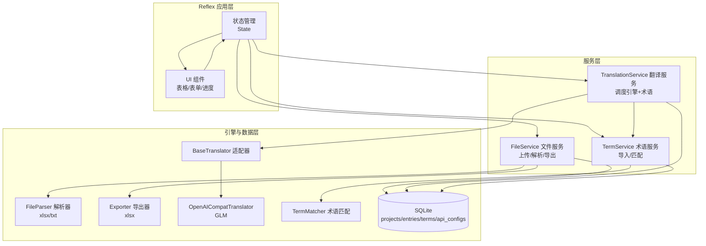

## 产品概述

一个基于 Python + Reflex 的通用本地化可视化平台，实现"上传源文件 → 调用大模型 API 翻译 → 人工可视化校对编辑 → 列表展示 → 导出交付文件"的完整闭环。定位为通用工具而非写死流程的个人工具，首期单用户运行，但架构需预留多用户、多语言、多翻译引擎的扩展空间。

## 核心功能

- 文件工程管理：以单个上传文件（xlsx/txt）为一个工程单元，围绕该文件进行解析、翻译、校对与产出
- 文件解析：支持 Excel(xlsx/xls) 表格类与 txt 文档类的源文案抽取，还原条目列表
- 多引擎翻译适配：翻译引擎抽象为适配器架构，首期实现 GLM（走 OpenAI 兼容接口），用户可配置自己的 API（base_url、api_key、model）；预留多平台扩展
- 术语约束：术语库支持导入与维护，翻译时命中术语优先使用指定译法，校对时高亮提醒命中条目
- 可视化校对编辑：以"源文案 ↔ 译文"对照表格呈现，人工可在线编辑、标记状态（待译/已译/已校对/需复核）
- 产出展示：后台以列表展示翻译结果与进度统计
- 导出交付：将结果导出为 xlsx 表格文件（含源文案、译文、状态、术语命中标记等）
- 进度概览：展示整体翻译进度、已校对比例、术语命中统计

## 技术栈选型

- 前端/后端一体化框架：Reflex（纯 Python，自带响应式 Web UI 与状态管理，无需前后端分离，契合单人工具场景）
- 翻译引擎客户端：openai 库（GLM 等众多大模型均提供 OpenAI 兼容接口，统一走 /chat/completions，降低多引擎适配成本）
- 文件解析：pandas + openpyxl（xlsx/xls 读写）、内置文本处理（txt）
- 数据持久化：SQLite（通过 SQLAlchemy 或 Reflex 自带 SQLModel），数据模型预留 user_id 字段
- 术语匹配：内置基于条目的术语词典匹配，翻译时拼入 Prompt，校对时做子串命中检测
- 导出：openpyxl 生成 xlsx
- 运行环境：Windows / PowerShell，Python 3.10+

## 实现策略

采用"分层 + 适配器"架构，将翻译引擎、文件解析、术语约束解耦为独立模块，Reflex 层只负责状态管理、UI 渲染与流程编排。核心决策：

1. 翻译引擎抽象为 `BaseTranslator` 适配器接口，首期实现 `OpenAICompatTranslator`（GLM 走该实现，通过配置 base_url/model/api_key 区分），后续新增引擎只需增加适配器类并注册，UI 下拉即出现。
2. 术语约束在翻译阶段作为系统指令注入 Prompt，在校对阶段作为条目标记在列表中高亮，两阶段分离实现"约束 + 提醒"。
3. 数据模型以"文件工程(project/file)"为顶层单元，内含 entries（源文案条目，含多语言译文字段、状态、术语命中标记），数据库统一预留 user_id 便于后期多用户扩展。
4. Reflex 状态类通过 `rx.event` 驱动翻译、校对、导出；大数据量列表采用分页加载避免渲染卡顿。

## 架构设计



## 目录结构

```
LocalizationTool/
├── app.py                       # [NEW] Reflex 应用入口，页面路由与页面组件定义
├── localization/
│   ├── __init__.py              # [NEW] 包初始化
│   ├── state.py                 # [NEW] Reflex 核心状态类：工程列表、条目管理、翻译/校对/导出事件
│   ├── config.py                # [NEW] 全局配置（数据库路径、默认模型、上传目录）
│   ├── models.py                # [NEW] SQLModel 数据模型：Project/Entry/TermEntry/ApiConfig（含 user_id 预留字段）
│   ├── db.py                    # [NEW] SQLite 初始化与会话管理
│   ├── services/
│   │   ├── __init__.py          # [NEW] 服务包
│   │   ├── file_service.py      # [NEW] 上传文件保存、解析调度（按扩展名选择解析器）、导出 xlsx
│   │   ├── parser.py            # [NEW] 文件解析器：ExcelParser(xlsx/xls)、TxtParser，将源文案转为条目列表
│   │   ├── exporter.py          # [NEW] 用 openpyxl 将条目结果导出为 xlsx（含源/译/状态/术语命中列）
│   │   ├── translation_service.py# [NEW] 翻译调度：批量调用引擎、注入术语约束、分批处理防超时
│   │   └── term_service.py      # [NEW] 术语库导入/查询/匹配（子串命中检测）
│   ├── translators/
│   │   ├── __init__.py          # [NEW] 适配器注册表（ENGINE_REGISTRY，UI 据此生成下拉）
│   │   ├── base.py              # [NEW] BaseTranslator 抽象基类：translate(text, term_context) -> str
│   │   └── openai_compat.py     # [NEW] OpenAICompatTranslator：OpenAI 兼容接口实现（GLM 走此）
│   └── components/
│       └── __init__.py          # [NEW] 可复用 Reflex 组件（对照表格、进度条、术语命中标记）
├── requirements.txt             # [NEW] 依赖清单（reflex、openai、pandas、openpyxl、sqlmodel 等）
├── uploads/                     # [NEW] 上传文件与导出文件存储目录（运行时生成）
└── README.md                    # [NEW] 项目说明、启动方式、架构说明、扩展新引擎指引
```

## 关键接口设计

```python
# translators/base.py — 翻译引擎抽象
class BaseTranslator(abc.ABC):
    name: str                       # 引擎显示名（GLM 等）
    def __init__(self, config: ApiConfig): ...
    @abc.abstractmethod
    def translate(self, text: str, target_lang: str, term_context: list[str]) -> str: ...

# translators/openai_compat.py — OpenAI 兼容实现（GLM）
class OpenAICompatTranslator(BaseTranslator):
    def __init__(self, config): ...  # base_url/api_key/model 来自 ApiConfig
    def translate(self, text, target_lang, term_context):
        # 拼装 system prompt（含术语约束）→ /chat/completions → 返回译文

# models.py — 核心数据模型（均预留 user_id）
class Project(SQLModel):          # 一个上传文件 = 一个工程
    id, user_id, filename, file_type, source_lang, target_langs(str, 逗号分隔)
    upload_time, total_count, translated_count, proofread_count
class Entry(SQLModel):            # 源文案条目
    id, user_id, project_id, source_text, translations(JSON: {lang: text})
    status(待译/已译/已校对/需复核), term_hits(JSON), sort_index
class TermEntry(SQLModel):        # 术语库
    id, user_id, source_term, target_term, note
class ApiConfig(SQLModel):        # 用户可配置的多引擎 API
    id, user_id, engine_name(如 "GLM"), base_url, api_key, model, is_default
```

## 实施注意事项

- 翻译批量调用需分批（如每批 20 条）并在 UI 用进度反馈，避免超时与体验卡顿
- 术语匹配用字符串子串检测即可满足首期，命中条目在 UI 高亮并可在 Prompt 中注入"若出现以下术语请优先采用指定译法"
- API 密钥存于本地 SQLite，仅本地单用户场景可接受；预留脱敏与后续多用户加密空间
- 导出列设计：序号、源文案、目标语言译文（每语言一列）、状态、命中术语，便于校对后交付
- 首期不引入认证，但 Project/Entry/TermEntry/ApiConfig 均含 user_id 字段且查询默认 user_id=0，后期多用户仅需加过滤

## 设计风格

采用现代化浅色工作台风格，兼顾专业与易用，适合后台数据编辑场景。整体以清晰的信息层级和克制的色彩呈现翻译工作流。

- 布局：左侧/顶部导航区分功能模块（我的文件、翻译校对、术语库、引擎配置），主体为对照表格工作区
- 对照编辑：采用"源文案 | 目标语言译文"双列表格，行内可直接编辑译文，状态用彩色徽标区分（待译灰、已译蓝、已校对绿、需复核橙）
- 进度概览：顶部进度条组件实时显示翻译/校对完成率，术语命中条目在行内高亮提示
- 交互：批量翻译按钮带进度反馈，行内编辑即时保存，hover 行高亮
- 响应式：桌面端为主，表格支持分页与筛选（按状态、按术语命中）

## 设计风格关键词

现代工作台、清晰层级、专业、轻量色彩、表格驱动、状态徽标、进度反馈

## Agent Extensions

### Skill

- **xlsx**
- 用途：在文件解析与导出环节，读取用户上传的 xlsx 源文件、将翻译校对结果导出为 xlsx 表格文件
- 预期产出：校验 Excel 解析与导出逻辑，确保多语言译文列与状态列正确写入

### SubAgent

- **code-explorer**
- 用途：在实施阶段核查 Reflex 项目脚手架（app 入口、rx.State 事件、组件组织方式）与 SQLModel 集成的最佳实践，避免路径与 API 约定偏差
- 预期产出：确认 Reflex 页面/状态/组件的标准写法，确保新建模块与框架约定一致