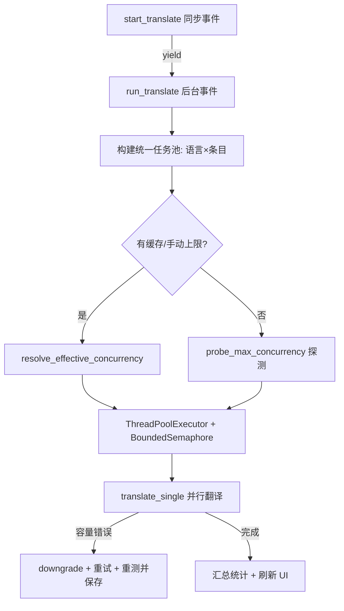

## 需求概述

将当前的翻译调用流程（逐行串行、一行一次请求）改造为「自动探测最高并发数 → 以最大并发并行调用」的高并发翻译模式，并持久化探测结果以便复用。

## 核心功能

- 翻译调度改为全局并发：语言与条目的所有翻译任务进入统一任务池，共享最大并发名额（如最大并发 8，可 8 个英文并行，下一批可 2 英文 + 6 韩语，不分语言）。
- 并发数自动探测：运行前若无缓存则探测最高并发数（并发 N 下所有请求成功即视为该并发有效）；有缓存直接复用。
- 探测结果持久化到 DB（跨重启保留），有缓存直接复用，无缓存才探测。
- 支持在 API 配置上手动设定并发上限（兜底），手动值优先于探测值。
- 运行中若引擎配额下降导致容量类报错（429/5xx/连接错误），自动降低并发重试，直到回归到可用并发数，重测并覆盖保存新值；之后再次遇到则重新走完整探测流程。

## 多语言翻译顺序现状

当前是先翻完英语整列再翻韩语整列（外层按语言串行、单语言内部也串行）。本次改造为全局并发后，多语言任务按并发名额动态交错调度，不再有固定的「先整列后整列」顺序。

## 边界与说明

- 判定标准：并发 N 下所有请求成功即视为该并发数有效（用户采纳最成熟方案）。
- 手动上限优先于缓存探测值；缓存缺失时才开始探测。
- 探测结果存 DB 跨重启保留；容量错误触发的重测结果覆盖旧缓存。

## 技术栈

- 沿用现有 Reflex 0.9.8 + Python + SQLModel + SQLite。
- 并发方案：线程池（`ThreadPoolExecutor`）+ 全局信号量（`threading.BoundedSemaphore`），不动引擎层（保持 openai 同步客户端），改动小、风险低。
- 容量错误识别：基于 openai 异常类型 + 异常消息关键词（429 / 5xx / RateLimit / APIConnection / 连接超时等）。

## 实现方案

### 系统架构



### 模块划分与数据流

- 数据流：`run_translate` 把语言方案行解析为「每语言任务配置（translator/prompt/terms/strategy）」→ 与 `entries` 组合成统一任务列表 → 通过信号量限制的线程池并行执行 `translate_single` → 写库（每条独立 session 事务，天然并发安全）→ 更新内存 entry 状态（加锁防读-改-写竞争）→ 汇总进度与统计。

## 实现细节（执行要点）

### 1. 模型与迁移（models.py / db.py）

- `ApiConfig` 新增两个字段：
- `max_concurrency: int = 0`（手动并发上限，0=自动/不限制）
- `tested_concurrency: int = 0`（探测并持久化的最优并发缓存，0=未探测）
- `db.init_db()` 用 `_ensure_column("apiconfig", "max_concurrency", "max_concurrency INTEGER NOT NULL DEFAULT 0")` 与 `tested_concurrency` 同模式迁移。
- `file_service.serialize_api_config` 增加两个字段输出；`save_api_config` 增加 `max_concurrency` 参数并写入。

### 2. 新增并发服务模块（localization/services/concurrency_service.py）

- `is_capacity_error(exc) -> bool`：分类判定容量类错误（RateLimit/APIConnection/APITimeout/HTTP 429/5xx/连接类）。
- `probe_max_concurrency(cfg, build_translator, probe_runner) -> int`：指数增长探测（1→2→4→8→…，受 `max_concurrency` 上限约束，硬上限如 16）；每档并发发 N 个最小探测请求，全部成功即有效；某档有失败则回退到上一档；结果写回 `tested_concurrency` 到 DB 并返回。
- `resolve_effective_concurrency(cfg) -> int`：手动 `max_concurrency>0` 则用之；否则若有 `tested_concurrency>0` 用之；否则返回 None 触发探测。
- `downgrade_concurrency(cfg, current) -> int`：降低当前并发（如 `max(1, current//2)` 或 `current-1`），触发重新探测并覆盖 `tested_concurrency`，保存 DB。

### 3. 抽取单条目翻译函数（translation_service.py）

- 从 `translate_entries` 抽出 `translate_single(entry, translator, prompt_msgs, *, source_lang, target_lang, terms, strategy, entry_lock, user_instruction="") -> int`：内部完成 `_should_translate` 判定、术语命中注入、`translate_one` 调用、`file_service.update_entry_text/update_entry_term_hits/update_entry_status`、内存 `entry.set_translation`（用 `entry_lock` 保护）。返回是否已翻译/跳过/失败。
- `translate_entries` 保留并改为循环调用 `translate_single`，保持向后兼容（其他调用方不破坏）。
- 说明：容量类异常需向上抛出以便调度层降级，非容量异常（如内容错误）按原逻辑计为 failed 不触发降级。

### 4. 重写 run_translate 调度（state.py）

- 构建语言方案列表（沿用现有解析逻辑：api → translator，tpl → prompt_msgs，terms → 术语，strategy）。
- 解析每个语言的有效并发（`resolve_effective_concurrency(api)`）；若为 None 则先探测；探测结果缓存到内存 dict（key 用 api.id），供同次运行复用。
- 构建统一任务列表：`[(lang_ctx, entry) for lang_ctx in lang_ctxs for entry in entries]`（跳过判定在 `translate_single` 内执行）。
- 全局 `BoundedSemaphore(effective)` 控制并发度；`ThreadPoolExecutor(max_workers=effective)` 执行任务。
- 全局 `entry_lock = threading.Lock()` 保护 `entry.set_translation` 内存写。
- 全局已完成计数（加锁）驱动进度回调，映射到 `progress_done/progress_total`（保持 `asyncio.run_coroutine_threadsafe` 排程方式）。
- 任务失败且 `is_capacity_error`：降并发（`downgrade_concurrency` + 更新信号量与线程池），把失败任务重新入队重试；重复遇到则再降；直至回到可用并发并重测保存。
- 收集每语言 summary（翻译/跳过/失败数），沿用现有收尾（刷新统计、load_entries、load_projects、toast）。

### 5. 设置页表单（settings.py / state.py）

- 表单加「并发上限（0=自动，留空不限制）」输入框，绑定新状态 `engine_form_max_concurrency`，`edit_api_config`/`reset_engine_form` 回填与清空，`save_api_config` 读取并传参。
- 已配置引擎列表卡片中展示「已探测并发」信息（若有 tested_concurrency）。
- `serialize_api_config` 输出保证列表展示可读。

### 6. 性能与稳定性

- 探测请求用最小 prompt（复用 `test_api_config` 思路），避免浪费 token。
- 信号量 + 有界线程池防止超发；SQLite 每任务独立事务，避免写冲突。
- 进度回调仍采用「每 5 条或完成时刷新 + 排入事件循环」模式，避免阻塞。
- 全程不阻塞 asyncio 事件循环（网络调用在线程池中执行）。

## 目录结构（改动文件）

```
localization/
├── models.py                 # [MODIFY] ApiConfig 增加 max_concurrency / tested_concurrency 字段
├── db.py                     # [MODIFY] init_db 增加两字段迁移（_ensure_column）
├── config.py                 # [MODIFY] 新增探测硬上限/最小探测档等常量
├── state.py                  # [MODIFY] 重写 run_translate 为全局并发任务池；新增 engine_form_max_concurrency 状态与读写；接入 concurrency_service
├── services/
│   ├── concurrency_service.py   # [NEW] 并发探测/解析/降级/容量错误分类
│   ├── translation_service.py   # [MODIFY] 抽取 translate_single；translate_entries 复用
│   └── file_service.py          # [MODIFY] save_api_config 加 max_concurrency 参数；serialize_api_config 输出新字段
└── pages/
    └── settings.py           # [MODIFY] 表单加并发上限输入框；列表展示已探测并发
```

## 关键代码结构（接口级）

```python
# concurrency_service.py 核心接口
def is_capacity_error(exc: Exception) -> bool: ...
def resolve_effective_concurrency(cfg) -> int | None: ...   # None=需探测
def probe_max_concurrency(cfg) -> int: ...                  # 探测并持久化 tested_concurrency
def downgrade_concurrency(cfg, current: int) -> int: ...    # 降级并重测持久化

# translation_service.py 单条目翻译
def translate_single(entry, translator, prompt_msgs, *, source_lang, target_lang,
                     terms, strategy, entry_lock) -> int: ...  # 1=已译 0=跳过 -1=失败；容量错则抛异常
```